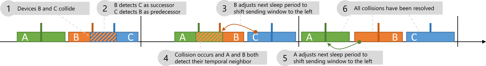

# DBM_LoRa_Simulation

This is a simulation of the Decentralized Burst Mitigation (DBM) mechanism for LoRa networks.



## Implementation and Structure

The simulation has been developed using the [r-simmer](https://r-simmer.org/) discrete event simulation framework for the R programming language.

To run the example provided in this repository ([run_dbm_sim.R](run_dbm_sim.R)), the following packages need to be present in the R environment:

- **simmer**
- **tidyverse** -- *Actually only ggplot2, margrittr and dplyr*
- **data.table** -- *For longer running simulation to keep evaluation performant*
- **futile.logger** -- *To provide output of the simulation progress*

```R
install.packages(c("simmer", "tidyverse", "data.table", "futile.logger"))
```
The code is structured as follows

```bash
.
├── LICENSE
├── README.md
├── resources # Contains the overview image and other resources
│   └── dbm_example.pdf
├── run_dbm_sim.R # Main file to run
└── sim # Contains the actual simulation source
    ├── 01_dbm_lora.R # Executes a more realistic multi channel scenario
    ├── 02_dbm_lora_one_channel.R # Executes a single channel scenario
    └── trajectories # Contains the trajectory definitions for each of the different mechanisms
        ├── dbm_device # DBM mechanism for LoRa
```

## Configuration

The [run_dbm_sim.R](run_dbm_sim.R) main file includes a preconfigured example simulation for both scenarios.
The simulation parameters are defined as below.

```R
period<-c(900,900)
run_time<- 1800
run=1
delta<-2
scenario<-"device_variation_one_channel" # or any suitable scenario name
devices <- 500
```

## Execution and Results

After running [run_dbm_sim.R](run_dbm_sim.R) using the provided configuration, the output should look as shown here.

```
> source("~/git/2022-dbm-icc/run_dbm_sim.R")
[1] "dbm_one_channel"
INFO [2022-10-31 14:53:47] 0
INFO [2022-10-31 14:53:47] 0.1
INFO [2022-10-31 14:53:47] 0.2
INFO [2022-10-31 14:53:47] 0.3
INFO [2022-10-31 14:53:47] 0.4
INFO [2022-10-31 14:53:54] 0.5
INFO [2022-10-31 14:54:04] 0.6
INFO [2022-10-31 14:54:04] 0.7
INFO [2022-10-31 14:54:04] 0.8
INFO [2022-10-31 14:54:04] 0.9
INFO [2022-10-31 14:54:10] 1
[1] "dbm_multi_channel"
INFO [2022-10-31 14:54:10] 0
INFO [2022-10-31 14:54:10] 0.1
INFO [2022-10-31 14:54:10] 0.2
INFO [2022-10-31 14:54:10] 0.3
INFO [2022-10-31 14:54:10] 0.4
INFO [2022-10-31 14:54:17] 0.5
INFO [2022-10-31 14:54:28] 0.6
INFO [2022-10-31 14:54:28] 0.7
INFO [2022-10-31 14:54:28] 0.8
INFO [2022-10-31 14:54:28] 0.9
INFO [2022-10-31 14:54:35] 1
```

Here, the output shows the percentage progress towards completion. The simulation creates three output files in the `./results/` folder.

**packetloss(...).csv** contains information regarding the packetloss for each device for the whole simualtion, as well as information about the spreading factor, payload, period, and used channel.

**devices(...).csv** contains the information of the temporal neighbors and transmissions for each device for the last simulated transmission cycle.

**timeline(...).csv** contains data for all the steps of the DBM mechanism with timestamps for the whole simulation duration.
## Contact

For questions or issues with the simulation, please raise an issue or contact 
Simon Raffeck (simon.raffeck@informatik.uni-wuerzburg.de) or any of the authors of the related publication.
